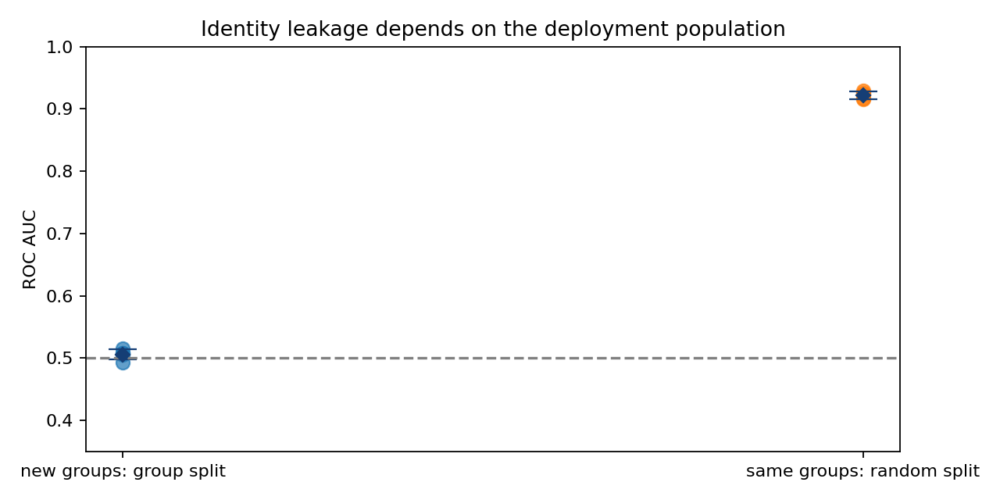

# Validation Stress Lab

**A good score is only useful when the validation protocol answers the right question.**

Four reproducible experiments examine group leakage, unstable shortcut features, probability calibration, and uncertainty under distribution shift. Original synthetic generators make every assumption visible. The datasets contain no real personal records.



## Measured findings

| Experiment | Observed result | What it means |
|---|---|---|
| Group identity, five seeds | Random-split AUC **0.922 ± 0.006**; unseen-group AUC **0.506 ± 0.008** | Choose a split that matches the deployment population. Values are mean ± sample SD, not confidence intervals. |
| Shortcut reversal, three seeds | Boosting with shortcut: IID AUC **0.977**, shifted **0.113**; stable features: shifted **0.772** | An IID score can depend on a relationship that will not persist. |
| Sigmoid calibration | Brier **0.173158 → 0.173115**; paired 95% bootstrap difference interval includes zero | This run does not establish that calibration helped. |
| Split conformal, nominal 90% | IID empirical coverage **88.9%**; shifted **69.0%** | Exchangeability matters; marginal coverage does not imply conditional coverage. |

These are controlled counterexamples, **not real-world performance claims**. CSV result tables and executed notebooks accompany each finding.

## Reproduce

```bash
python -m pip install -r requirements.txt
python -m unittest discover -s . -v
python make_data.py
python group_validation.py
python missingness_shift.py
python calibration.py
python conformal.py
```

Scripts save tables and figures to `outputs/`. On a headless machine set `MPLBACKEND=Agg`. The pinned environment used Python 3.13, NumPy 2.2.6, pandas 2.3.1 and scikit-learn 1.7.1. Notebook version banners record the actual runtime. Regenerating in a newer environment can cause small numerical differences.

## Read the notebooks

| Question | Notebook |
|---|---|
| What does a validation split measure? | [Group leakage](notebooks/group-leakage-what-does-your-validation-measure.ipynb) |
| How do missingness and shortcuts fail? | [Distribution shift](notebooks/missingness-and-shortcuts-under-distribution-shift.ipynb) |
| Does calibration actually help? | [Calibration and paired bootstrap](notebooks/calibration-ranking-is-not-probability-quality.ipynb) |
| When do intervals lose coverage? | [Split conformal](notebooks/conformal-coverage-iid-versus-covariate-shift.ipynb) |

## Application on competition data

[Airline Satisfaction](competition/README.md) applies fixed-fold CV to 699,635 training rows. The submitted baseline scored **0.95821 public ROC AUC**; cross-fitted target encoding improved it to **0.95970** (OOF AUC **0.960140**). The service-summary variant did not improve CV and was not submitted. Raw competition data and predictions are excluded from Git. [Run the Kaggle study](https://www.kaggle.com/code/zangar09417/s6e10-fixed-fold-cv-and-feature-ablations).

The companion [Causal LM Lab](https://github.com/zoga228/causal-lm-lab) studies decoder architecture and separate held-out evaluation.

[Study-level MRI transfer](competition/rsna/README.md) extends the work to 58 labeled studies from a real benchmark. With matched C=.01 regularization, acquisition descriptors scored **0.549108** OOF AUC and frozen MRI features **0.687270**. The code, target-level results and decoder diagnostics are available; scanner shortcuts and small-sample uncertainty limit the interpretation. The public ResNet18 backbone was pretrained by torchvision, and our implementation supplies pooling, supervised classification and validation.

## Data and limitations

`make_data.py` is the source of truth. The three benchmark packs are grouped identity classification, classification with missingness and a reversible shortcut, and heteroscedastic regression under covariate shift. `data-card.json` documents rows and columns. Synthetic data is released under CC0-1.0; source code is MIT. Test populations are never used to fit or tune a model. The calibrated-model bootstrap conditions on the fitted models; it does not quantify training-set variability.

Development used AI assistance for implementation and editing. Results come from executed experiments, with assumptions and negative results retained.

## References

- [scikit-learn: group splitting](https://scikit-learn.org/stable/modules/generated/sklearn.model_selection.GroupShuffleSplit.html)
- [scikit-learn: probability calibration](https://scikit-learn.org/stable/modules/calibration.html)
- [Angelopoulos and Bates: conformal prediction](https://arxiv.org/abs/2107.07511)
