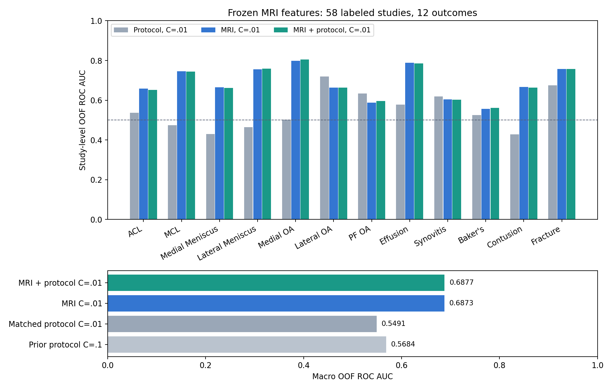

# Study-level MRI transfer with sparse labels

Frozen image features improved OOF discrimination on the 58 labeled studies in the RSNA Knee benchmark. This study compares acquisition descriptors with actual MRI pixels, and records the uncertainty created by sparse labels and possible site confounding. Results were measured on 7 October 2026.



| Pipeline | Fixed logistic C | Macro OOF ROC AUC |
|---|---:|---:|
| Previous acquisition baseline | .1 | 0.568399 |
| Acquisition baseline with matched regularization | .01 | 0.549108 |
| Frozen MRI features | .01 | 0.687270 |
| Frozen MRI features + acquisition descriptors | .01 | 0.687659 |

These are cross-validation results. The image competition submissions were accepted, but their hidden-test scores were still pending when this study was recorded. Adding protocol descriptors changed the image-model macro AUC by only 0.000389; this small difference does not establish a useful benefit.

## Method

For each study, the extractor selects one fluid-sensitive preferred sequence in each of the sagittal, coronal and axial planes. DICOM InstanceNumber orders its slices; two central slices are decoded per plane. A fixed 1st-to-99th percentile intensity mapping produces grayscale RGB inputs for the standard ResNet18 ImageNet preprocessing. The frozen network's 512-dimensional output is averaged within each plane and concatenated with plane-presence and slice-count features. All 348 selected training slices decoded successfully; the development test contributed 18 slices from three studies. The hidden rerun reads its replaced test images.

The network uses [official publicly pretrained torchvision weights](https://docs.pytorch.org/vision/stable/models/generated/torchvision.models.resnet18.html). We did not train that backbone. The pooling, supervised classification and evaluation code were developed here with AI assistance. Training fits twelve balanced L2 logistic classifiers. Each target uses three stratified folds, seed42, and fits StandardScaler only on its training fold. C=.01 is fixed for both image variants and the matched acquisition comparison. No test labels, reports or study identifiers are feature inputs. Identifiers locate and group images only.

The comparison against the previous C=.1 baseline changes both features and regularization. The added C=.01 acquisition run holds regularization fixed, so that comparison isolates the feature-set change within this evaluation protocol. Its output is an analysis control and was not submitted as an extra competition entry.

## Reproduce

Obtain the official [competition data](https://www.kaggle.com/competitions/rsna-knee-abnormality-detection/data) after accepting its rules. The source expects train.csv, test.csv, train_series.csv, test_series.csv, and train_series/<study>/<series>/*.dcm and test_series/<study>/<series>/*.dcm. The full dataset is large; running on Kaggle is practical. Raw data, row-level predictions, embeddings and model binaries are excluded from this repository.

```bash
cd competition/rsna
python -m pip install -r requirements.txt
python -c "import torch; from torchvision.models import ResNet18_Weights; torch.save(ResNet18_Weights.IMAGENET1K_V1.get_state_dict(progress=True, check_hash=True), 'resnet18-imagenet.pth')"
python run_images.py --data /path/to/competition --weights resnet18-imagenet.pth --output outputs
python run_metadata.py --data /path/to/competition --regularization .01 --output outputs/protocol-c001
python run_metadata.py --data /path/to/competition --regularization .1 --output outputs/protocol-c01
```

Prepare weights and decoder packages before running an offline competition notebook. The script saves both prespecified prediction variants and their metrics; copy the chosen output to submission.csv for a code submission. The Kaggle input notebook ran on GPU. Exact results may vary with package versions and hardware. [Aggregate measured results](validation-results.json) include target prevalence and decoder diagnostics. [Acquisition baseline source](metadata_baseline.py) records the prior comparator.

## What this validation cannot show

Only 58 labeled studies are available; the image vector has 1,542 features. Strong regularization does not remove small-sample uncertainty. MCL has nine positive studies, and several other targets are rare. The split separates studies, but no patient or site identifiers establish patient-disjoint or site-disjoint evaluation. Scanner and acquisition shortcuts can persist across folds. The backbone was trained on natural images rather than specialist MRI data. No confidence interval, clinical diagnostic performance or final-test superiority is claimed. Public leaderboard results must be assessed separately.

## Sources and attribution

- [Competition data and evaluation](https://www.kaggle.com/competitions/rsna-knee-abnormality-detection)
- [ResNet18 model and preprocessing](https://docs.pytorch.org/vision/stable/models/generated/torchvision.models.resnet18.html)
- [Torchvision code license, BSD-3-Clause](https://github.com/pytorch/vision/blob/main/LICENSE)
- [Our submitted image study](https://www.kaggle.com/code/zangar09417/rsna-mri-embeddings-images-only)

The competition notebooks are private while experiments are evaluated; the reproducible implementation and aggregate results are provided here. Source written for this study follows the repository's MIT license; third-party weights and libraries retain their own terms.
